# ✅ FastAPI + Docker + VSCode Remote-Container デバッグ環境
## 概要
FastAPIをDockerコンテナで起動し、Visual Studio Codeからデバッグ実行を行うための環境構築サンプル

---
## 動作確認
本リポジトリをCLONEした場所でコンテナ起動コマンドを実行.  
```
docker compose up --build
```

VisualStudioCodeの左ペインの、[Remote Explorer] > [Dev Containers] から、起動したDockerコンテナを新規ウィンドウで開く

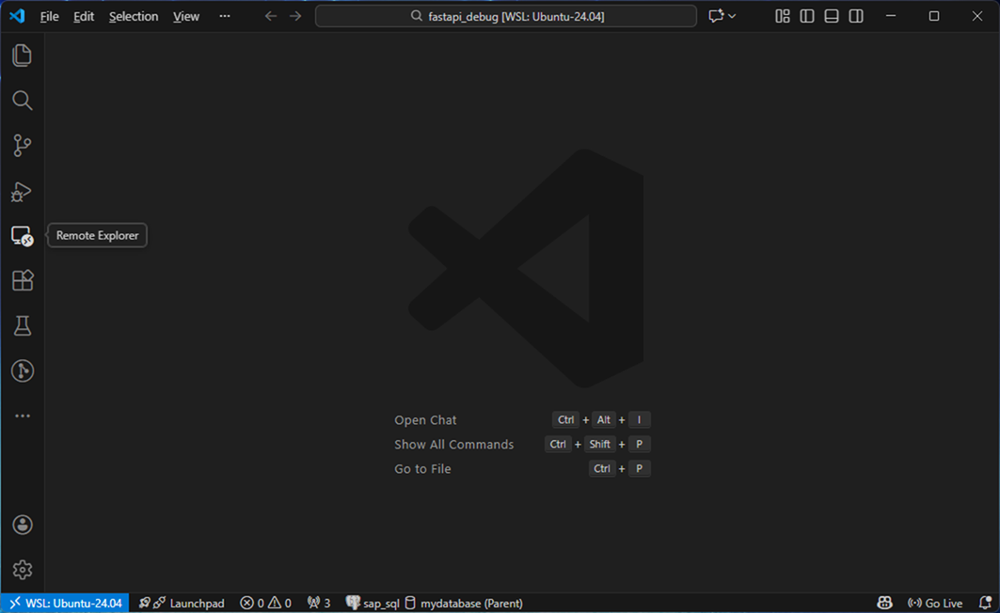
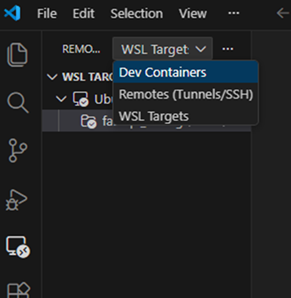
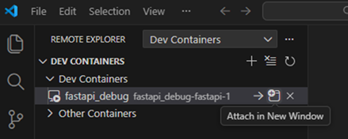

コンテナにアタッチした状態の新規ウィンドウが起動
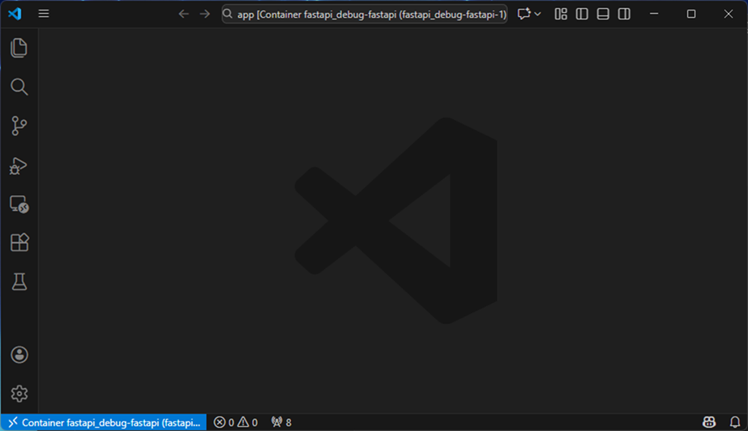

Pythonの拡張機能がワークスペースにインストールされているか確認.  
※されていなかったらインストールする  
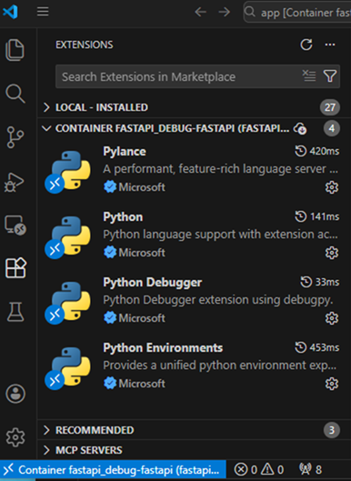

デバッグ対象のPythonファイルにブレークポイントを設定する.  
以下例では、main.py の8行目に設定.  
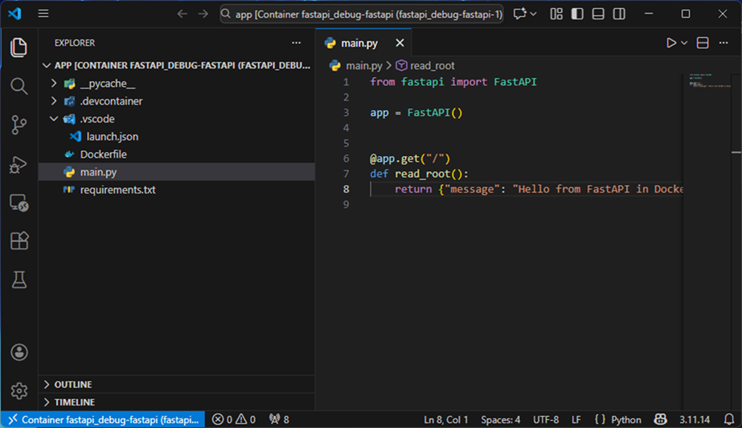
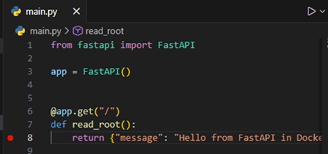

VisualStudioCodeの左ペインの、[Run and Debug]を開き、`launch.json`で設定したデバッグ構成を選択する.  
ここでは、「Attach to FastAPI in Docker」  
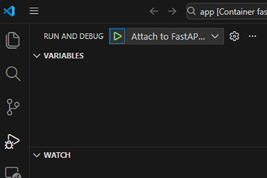
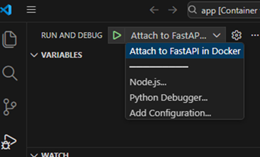

「▶」マーク(Start Debugging)を押下し、デバッグを開始.  
ウィンドウ上部に「||」マーク(Pause)が現れたりしたら正常に開始している.  
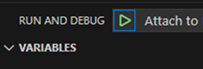
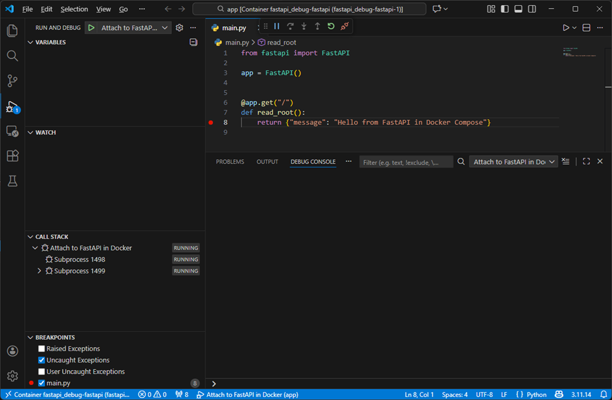

SwaggerUI上からリクエストを送信し、ブレークポイントで止まることを確認する.  

http://localhost:8000/docs にアクセス
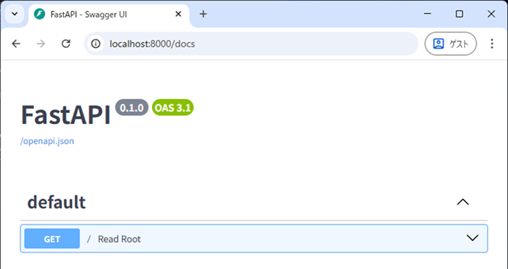

[Try it out] > [Execute] でリクエスト実行  
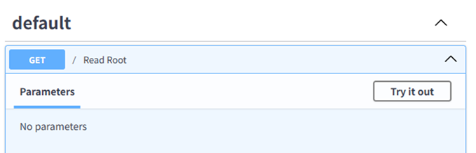
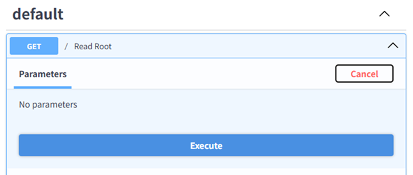

デバッグ実行に成功していると、以下のようにレスポンスが待たされる
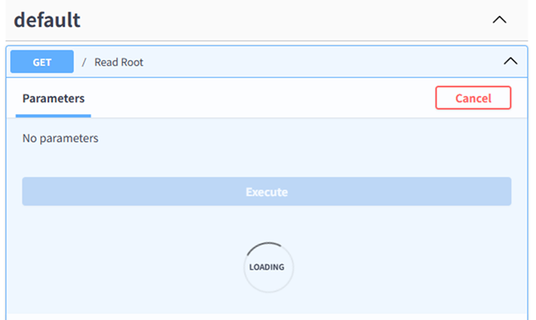

Visual Studio Code上で、ブレークポイントで処理が止まっていることを確認
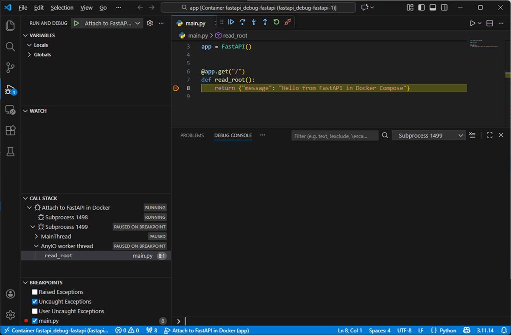

---

## 📂 ディレクトリ構成

```
    ├── app
    │   ├── .devcontainer
    │   │   └── devcontainer.json
    │   ├── .vscode
    │   │   └── launch.json
    │   ├── Dockerfile
    │   ├── main.py
    │   └── requirements.txt
    └── docker-compose.yml
```

### 各ファイルの説明

| パス | 説明 |
| --- | --- |
| `docker-compose.yml` | 複数サービス（FastAPI、DB など）を管理する Compose ファイル。FastAPI コンテナのポート公開（8000, 5678）やボリューム設定を記載。 |
| `app/Dockerfile` | FastAPI アプリ用の Docker イメージ定義。Python 環境構築、依存関係インストール、`debugpy`を使ったデバッグ起動設定を含む。 |
| `app/main.py` | FastAPI アプリのエントリーポイント。API エンドポイントを定義。 |
| `app/requirements.txt` | FastAPI、Uvicorn、debugpy など Python 依存パッケージを記載。 |
| `app/.devcontainer/devcontainer.json` | VSCode Remote-Container 設定。コンテナをワークスペースとして開くための設定（Python 拡張、デバッグ設定など）。 |
| `app/.vscode/launch.json` | VSCode のデバッグ構成。`Attach`モードで debugpy に接続するための設定（ポート 5678、パスマッピング）。 |

---

## ✅ 各コンポーネントの役割

### **VSCode**

- **IDE**としてコード編集・デバッグ操作を行う。
- **Remote-Container 拡張機能**でコンテナをワークスペースとして開く。
- **Python 拡張機能**＋**Debugger UI**でデバッグ。

### **Docker コンテナ**

- FastAPI アプリを隔離された環境で実行。
- **debugpy**を起動し、VSCode からのリモートデバッグを受け付ける。

### **Python デバッグランタイム（debugpy）**

- Python 公式デバッグプロトコルを実装。
- `--listen 0.0.0.0:5678`で VSCode からの接続を待機。
- 接続後に FastAPI アプリを起動。

### **FastAPI**

- Python 製 Web フレームワーク。
- Uvicorn で HTTP リクエストを処理。
- debugpy 経由でブレークポイントが有効。

---

## ✅ アーキテクチャ図（Mermaid）
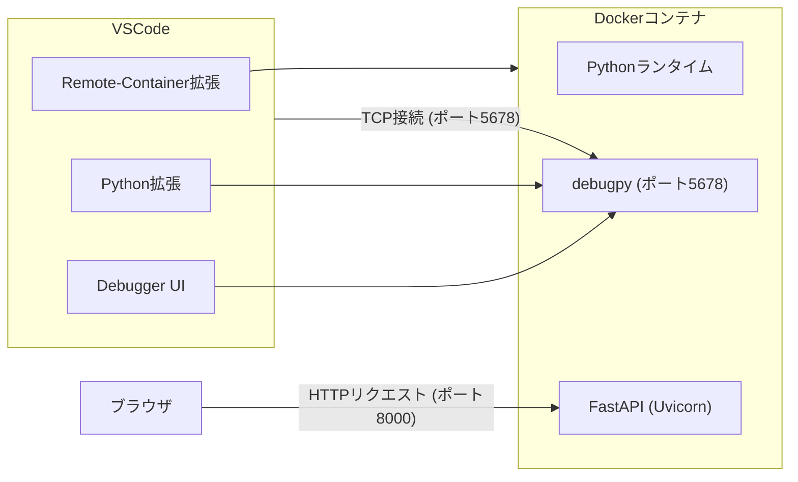
---

## ✅ デバッグの仕組み

1.  **Docker コンテナ起動**\
    `docker-compose up`で FastAPI コンテナが起動し、debugpy が 5678 ポートで待機。
2.  **VSCode Remote-Container 接続**\
    VSCode がコンテナをワークスペースとして開く。
3.  **VSCode → debugpy に接続**\
    VSCode が TCP で`localhost:5678`に接続し、ブレークポイントを有効化。
4.  **FastAPI リクエスト発生**\
    `http://localhost:8000`にアクセスすると、ブレークポイントで停止。

---

## ✅ 実行手順

1.  VSCode で「Remote-Containers: Open Folder in Container」を選択。
2.  コンテナ起動後、**デバッグビュー**で「Attach to FastAPI in Docker」を選択。
3.  ブレークポイントを設定 → `http://localhost:8000` にアクセス。
4.  Swagger UI は `http://localhost:8000/docs`。

---
