# ✅ FastAPI + Docker + VSCode Remote-Container デバッグ環境
## 概要
FastAPIをDockerコンテナで起動し、Visual Studio Codeからデバッグ実行を行うための環境構築サンプル

---
## ✅ 実行手順
本リポジトリのディレクトリをVisual Studio CodeのWorkspace(ウィンドウ)として開く
```shell
$ code fastapi_debug
```


コンテナ起動コマンドを実行.  
```shell
$ docker compose up --build
```

Pythonの拡張機能がワークスペースにインストールされているか確認.  
以下で検索
```
@installed Python Debugger
```
※されていなかったらインストールする  
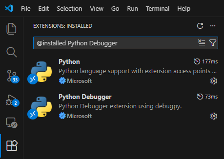

デバッグ対象のPythonファイルにブレークポイントを設定する.  
以下例では、app/main.py の8行目に設定.  
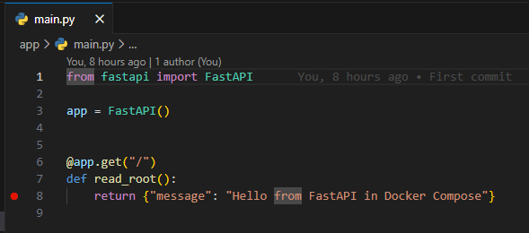

VisualStudioCodeの左ペインの、[Run and Debug]を開き、`.vscode/launch.json`で設定したデバッグ構成を選択する.  
ここでは、「Attach to FastAPI in Docker #1」  
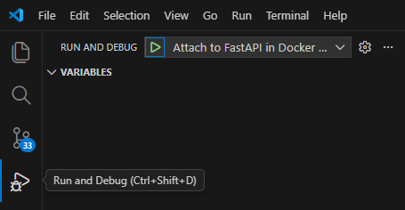
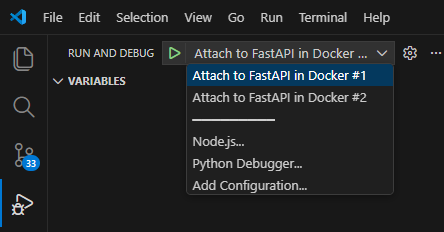

「▶」マーク(Start Debugging)を押下し、デバッグを開始.  
ウィンドウ上部に「||」マーク(Pause)が現れたりしたら正常に開始している.  
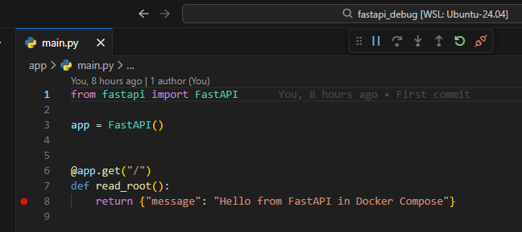

SwaggerUI上からリクエストを送信し、ブレークポイントで止まることを確認する.  

http://localhost:8001/docs にアクセス
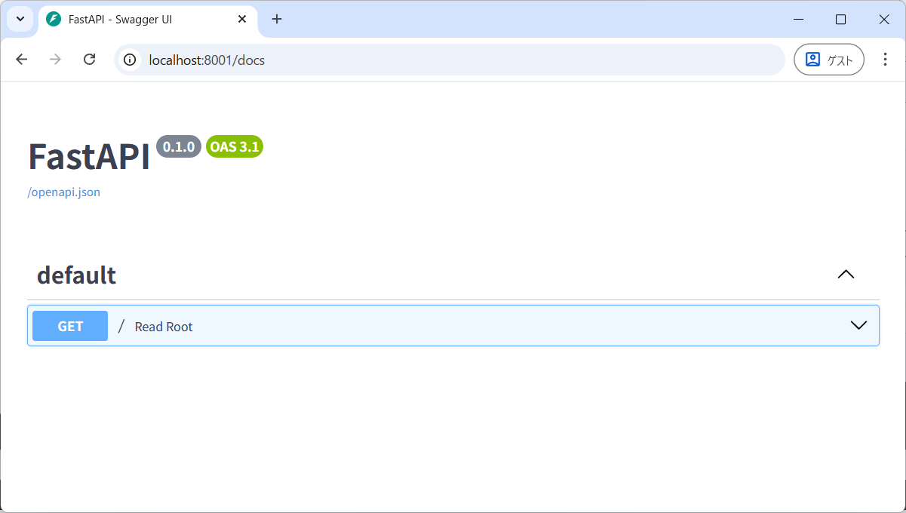

[Try it out] > [Execute] でリクエスト実行  
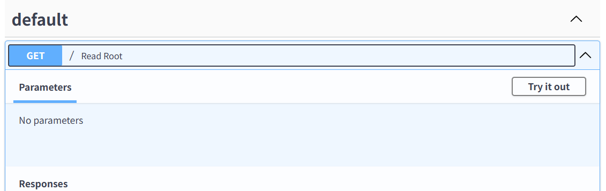
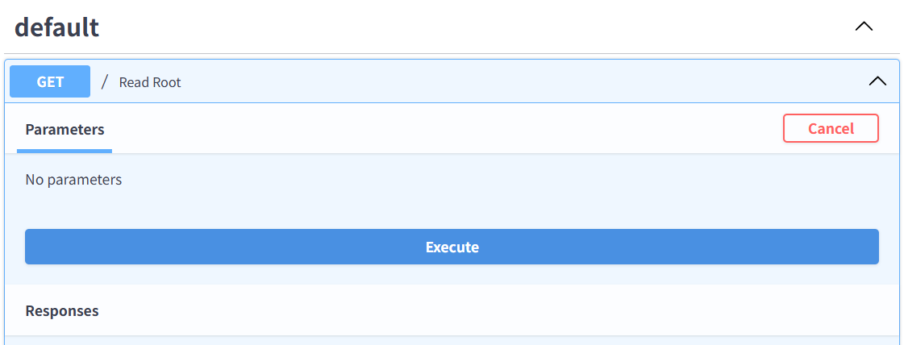

デバッグ実行に成功していると、以下のようにレスポンスが待たされる
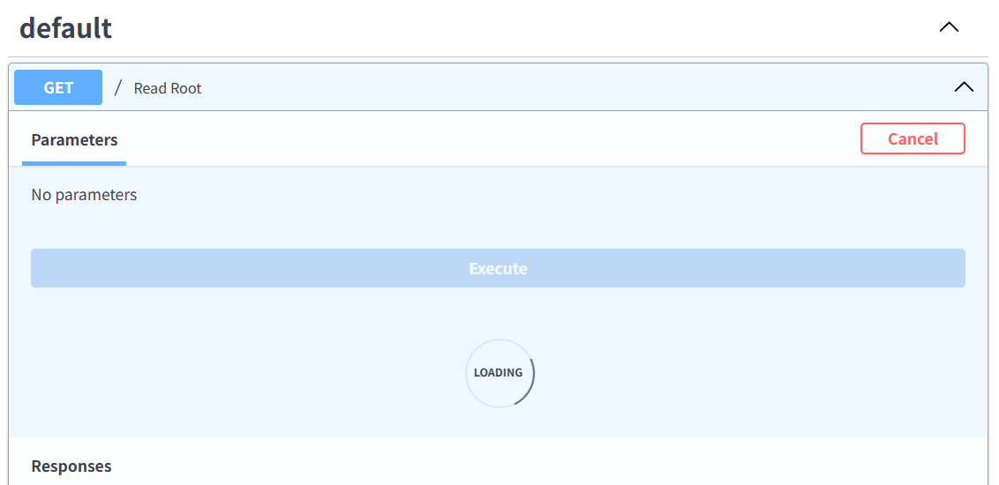

Visual Studio Code上で、ブレークポイントで処理が止まっていることを確認
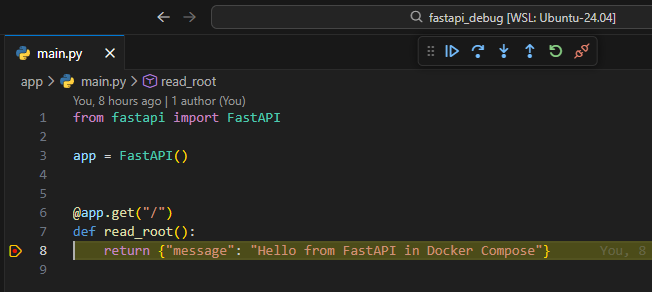

---

## 📂 ディレクトリ構成

```
├── .vscode ★ Visual Studio CodeのWorkspace設定用
│   └── launch.json ★ デバッグ実行の設定を記述
├── app
│   ├── Dockerfile
│   ├── main.py
│   └── requirements.txt
├── app2
│   ├── Dockerfile
│   ├── main.py
│   └── requirements.txt
└── docker-compose.yml ★ デバッグ実行用の設定を記述
```

### ポイント
1. ディレクトリ構成  
    .vscodeをWorkspaceのルートレベルに配置する.  
1. デバッグ実行用の設定を、本番用ソース(appディレクトリ内)に持ち込まない  
    .vscodeの追加と、docker-compose.ymlへの追記のみで完結
1. docker-compose.ymlにデバッグ実行用の設定を追加する  
    ★ debug実行ではない場合は、該当の記述は逆に取り除く必要がある
    ```yml
    fastapi:
      ports:
        - "56781:5678" # debugpy用のポート設定
      command: > # debugpyのインストールと実行(リッスン)
        sh -c "pip install --no-cache-dir debugpy &&
        python3 -m debugpy --listen 0.0.0.0:5678 --wait-for-client
        -m uvicorn main:app --host 0.0.0.0 --port 8000 --reload"
    ```
1. launch.jsonに、デバッグ実行対象のコンテナ分の設定を記述する  
    `.vscode/launch.json`
    ```json
    {
    "version": "0.2.0",
    "configurations": [
        {
        "name": "Attach to FastAPI in Docker #1",
        ...
        "connect": {
            "host": "localhost",
            "port": 56781 ★docker-compose.ymlで指定したWSLホスト側のポートを指定
        },
        ...
        },
        {
        "name": "Attach to FastAPI in Docker #2",
        ...
        "connect": {
            "host": "localhost",
            "port": 56782 ★docker-compose.ymlで指定したWSLホスト側のポートを指定
        },
        ...
        }
    ]
    }
    ```


---

## ✅ 各コンポーネントの役割

### **VSCode**

- **IDE**としてコード編集・デバッグ操作を行う。
- **Remote-Container 拡張機能**でコンテナをワークスペースとして開く。
- **Python 拡張機能**＋**Debugger UI**でデバッグ。

### **Docker コンテナ**

- FastAPI アプリを隔離された環境で実行。
- **debugpy**を起動し、VSCode からのリモートデバッグを受け付ける。

### **Python デバッグランタイム（debugpy）**

- Python 公式デバッグプロトコルを実装。
- `--listen 0.0.0.0:5678`で VSCode からの接続を待機。
- 接続後に FastAPI アプリを起動。

### **FastAPI**

- Python 製 Web フレームワーク。
- Uvicorn で HTTP リクエストを処理。
- debugpy 経由でブレークポイントが有効。

---

## ✅ アーキテクチャ図（Mermaid）
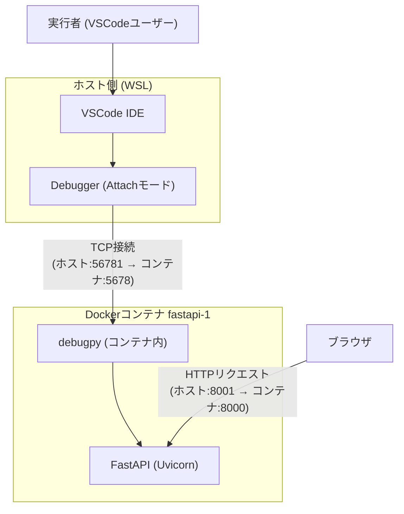
---

## ✅ デバッグの仕組み

1.  **Docker コンテナ起動**\
    `docker-compose up`で FastAPI コンテナが起動し、debugpy が 56781 ポートで待機。
2.  **VSCode Remote-Container 接続**\
    VSCode がコンテナをワークスペースとして開く。
3.  **VSCode → debugpy に接続**\
    VSCode が TCP で`localhost:56781`に接続し、ブレークポイントを有効化。
4.  **FastAPI リクエスト発生**\
    `http://localhost:8001`にアクセスすると、ブレークポイントで停止。

---
